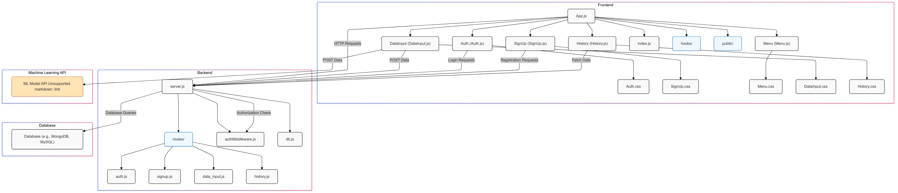
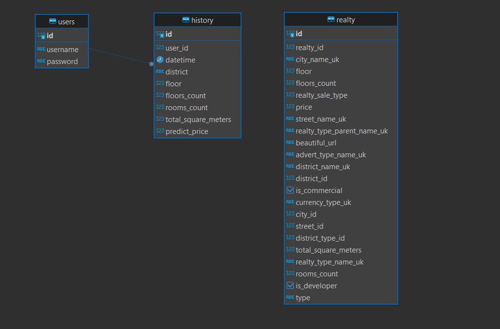
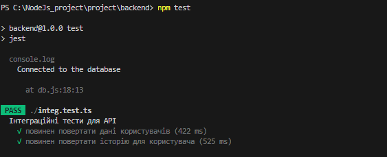
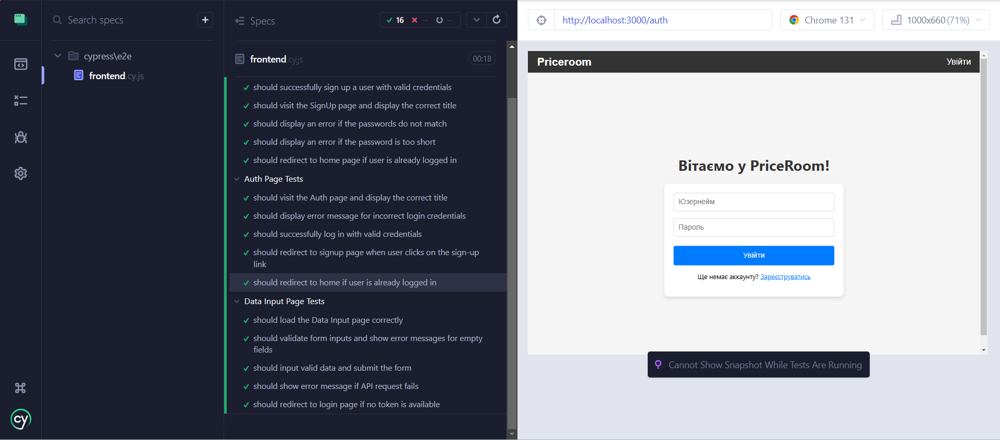

### Вибір стилю коду

Для підтримки єдиного стилю коду в проєкті ми використовуємо **Prettier** як форматер. Prettier автоматично відформатує код за стандартами, що дозволяє команді дотримуватись єдиного стилю без необхідності вручну перевіряти відступи, розриви рядків або використання лапок. Вибір Prettier базується на його простоті та широкому використанні в спільноті, що забезпечує зручність для великих команд.

### Налаштування форматтера

Для форматування коду використовується **Prettier**. Цей інструмент автоматично виправляє проблеми зі стилем коду, такі як:

- відступи
- форматування рядків
- позиція фігурних дужок
- використання лапок (одинарних або подвійних)
- пробіли між елементами та інше

Prettier підтримує різні типи файлів, такі як **JavaScript**, **TypeScript**, **CSS**, **JSON**, **HTML** і **Markdown**, що дозволяє легко форматувати код на різних рівнях проєкту.

### Налаштування лінтера або іншого статичного аналізатора

Для статичного аналізу та перевірки якості коду ми використовуємо **ESLint**. ESLint допомагає виявляти потенційні помилки в коді, недотримання стандартів стилю або навіть антипатерни програмування. Ми налаштовуємо його для роботи з **JavaScript** або **TypeScript**, а також можемо додавати спеціальні плагіни для перевірки коду в специфічних фреймворках чи бібліотеках (наприклад, React).

Основні функції ESLint:

- Виявлення синтаксичних помилок у коді
- Перевірка використання змінних
- Дотримання стандартів написання коду (наприклад, правила для відступів, використання крапок з комами тощо)
- Можливість інтеграції з IDE для надання зворотного зв'язку під час написання коду

### Налаштування Git-hook на комміт та пуш

Для автоматизації процесу перевірки коду перед комітом і пушем ми використовуємо **Husky** та **lint-staged**.

1. **Husky** дозволяє налаштувати Git hooks (сценарії, що виконуються під час певних дій з Git, наприклад, перед комітом або пушем). Це забезпечує автоматичну перевірку коду без необхідності вручну запускати інструменти перевірки.

2. **lint-staged** обмежує запуск лінтера та форматтера лише на тих файлах, які були змінені, що дозволяє значно зекономити час, не перевіряючи весь проєкт.

Налаштування включає:

- **Pre-commit hook**: перевірка та автоматичне форматування змінених файлів за допомогою Prettier.
- **Pre-push hook**: перед пушем можна налаштувати виконання тестів, збірки проєкту або перевірку лінтером, щоб переконатися, що тільки відформатований і без помилок код потрапляє в основну гілку.

### Перевірка форматування, лінтер, тести, збірка/компіляція проекту

Під час налаштування Git hooks ми можемо автоматично запускати кілька перевірок:

- **Перевірка форматування**: перед комітом автоматично запускається форматування коду за допомогою Prettier, щоб переконатися, що весь код відповідає обраному стилю.
- **Лінтер**: ESLint перевіряє код на наявність помилок та невідповідностей стилю. Це допомагає зберігати високу якість коду та виявляти проблеми на ранніх етапах.
- **Тести**: для перевірки коректності роботи коду можуть бути налаштовані тести, які будуть виконуватись перед пушем.
- **Збірка/компіляція**: перед пушем або під час CI/CD процесу можна запускати збірку проєкту, щоб переконатись, що код успішно компілюється.

### Загальний процес

1. Кожен раз перед комітом запускаються наступні перевірки:
   - **Форматування** за допомогою Prettier.
   - **Лінтинг** за допомогою ESLint.
2. Перед пушем виконуються:
   - **Тести**, щоб перевірити коректність роботи коду.
   - **Збірка проєкту** для перевірки, чи компілюється код без помилок.

## Діаграма компонентів ПЗ

## Дані та їх зв’язки

## Опис як дані оновлюються\змінюються\агрегуються на основі ключових сценаріїв, які виконує додаток

---

### 1. **Реєстрація користувача (SignUp)**

Реєстрація користувача передбачає створення нового облікового запису в системі. Користувач вводить своє ім'я користувача (username), пароль та підтверджує пароль. Якщо паролі не співпадають або пароль занадто короткий, система виводить відповідні помилки. Після успішної реєстрації, користувач отримує повідомлення про створення акаунта.

#### Ключові моменти:

- Перевірка наявності користувача з таким самим ім'ям.
- Шифрування пароля перед збереженням.
- Використання JWT для подальшої авторизації.

---

### 2. **Авторизація користувача (Auth)**

Користувач вводить свої облікові дані (ім'я користувача та пароль). Система перевіряє правильність введених даних. Якщо авторизація успішна, сервер генерує токен доступу (JWT), який зберігається в `localStorage`. Якщо дані неправильні, виводиться повідомлення про помилку.

#### Ключові моменти:

- Перевірка користувача та пароля.
- Генерація та зберігання токену JWT для подальшого доступу.
- Перенаправлення користувача на головну сторінку після успішної авторизації.

---

### 3. **Прогноз ціни нерухомості (DataInput)**

Користувач вводить дані про нерухомість (район, поверх, кількість поверхів, кількість кімнат та площа). На основі цих даних система прогнозує ціну. Після підтвердження форми, відправляються дані на сервер для прогнозу ціни та збереження історії.

#### Ключові моменти:

- Форма вводу даних з перевірками на валідність.
- Виведення прогнозованої ціни на основі наданих даних.
- Надсилання прогнозу на сервер та збереження результатів у базі даних.

---

### 4. **Data Input (Форма вводу даних для прогнозу ціни)**

Цей компонент відповідає за форму, в якій користувач вводить інформацію про нерухомість. Він включає в себе:

- Перевірку на правильність введених даних (наприклад, перевірка на правильний діапазон чисел).
- Після натискання кнопки "Підтвердити" відправка даних на сервер для отримання прогнозу ціни.

#### Ключові моменти:

- Обробка введених даних через `useState` та `useEffect`.
- Виведення помилок при неправильному заповненні.
- Завантаження прогнозу ціни після обробки форми.

---

### 5. **Історія прогнозів ціни (History)**

Користувач може переглядати історію прогнозів цін, яка зберігається в базі даних. Для цього потрібно авторизуватися, а потім отримати список всіх прогнозів, які були збережені для цього користувача. Дані включають район, поверх, кількість кімнат, площу, а також прогнозовану ціну.

#### Ключові моменти:

- Отримання історії прогнозів з бази даних за допомогою API.
- Перевірка авторизації користувача через JWT.
- Виведення історії прогнозів на інтерфейс.

---
Ось оновлений звіт з шляхами до файлів тестів, щоб забезпечити ясність у розташуванні тестових файлів у вашому проекті.

### Репорт: Оцінка ефективності покриття тестами та рекомендації щодо поліпшення

#### 1. **Вступ**
У процесі розробки ми приділили особливу увагу якості тестування для забезпечення стабільності і надійності нашого коду. Було проведено кілька видів тестів: юніт-тести, інтеграційні тести, E2E-тести та мутаційне тестування, щоб забезпечити повноцінне покриття різних аспектів нашого додатку.

#### 2. **Юніт-тести (Frontend)**
Для забезпечення коректності компонентів на фронтенді було створено юніт-тести для перевірки окремих функціональних одиниць коду. Це включало:
- **Тести на компоненти React**: тестування рендерингу компонентів і їхніх взаємодій (наприклад, перевірка правильності рендерингу даних, виклику колбеків).
- **Тести на функції**: тестування окремих функцій, таких як перевірка валідації введених даних, перетворення даних тощо.
- **Інструменти**: для написання тестів використовувалися **Jest** та **React Testing Library**. Ці інструменти дозволяють ефективно перевіряти логіку компонентів та їхнє взаємодія з DOM.

  **Шлях до тестів**:
  - Тести для компонентів знаходяться в папці `frontend/src/components` 

  **Досягнення**:
  - Покриття ключових компонентів додатку тестами.

#### 3. **Інтеграційні тести**
Інтеграційні тести були написані для перевірки взаємодії компонентів один з одним і з бекендом. Основна мета полягала в тому, щоб переконатися, що різні частини системи працюють коректно разом.
- **Тести API**: тестування взаємодії між фронтендом та бекендом (наприклад, перевірка, чи коректно відправляються запити до сервера, і чи відповідає сервер очікуваним результатом).
- **Тести інтеграції з БД**: перевірка коректності роботи з базою даних на рівні API.
- **Інструменти**: використано **Jest** для тестування API, а також **Supertest** для взаємодії з сервером.

  **Шлях до тестів**:
  - Тест інтеграції з API знаходяться в папці `backend/` 

  **Досягнення**:
  - Виявлені помилки в інтеграції компонентів фронтенду та бекенду.
  - Підвищено надійність взаємодії компонентів.

  

#### 4. **E2E-тести**
E2E (End-to-End) тести були застосовані для перевірки роботи додатку в цілому, як одного цілісного процесу. Це дозволяє симулювати поведінку реальних користувачів і перевіряти всю систему від початку до кінця.
- **Тести сценаріїв користувачів**: тестування основних користувацьких сценаріїв, таких як реєстрація, авторизація, заповнення форм, взаємодія з елементами на сторінці.
- **Інструменти**: для написання E2E тестів використовувався **Cypress**, який дозволяє легко і швидко створювати тести для браузерних сценаріїв.

  **Шлях до тестів**:
  - Тести E2E знаходяться в папці `frontend/cypress/integration/`.

  **Досягнення**:
  - Повне тестування взаємодії користувача з додатком.
  - Виявлені проблеми в UX та логіці взаємодії з інтерфейсами.

   

#### 5. **Мутаційне тестування**
Мутаційне тестування дозволило оцінити ефективність наших тестів. Ми використали інструмент **Stryker** для генерації мутантів (штучних помилок) у коді і перевірки, чи здатні тести виявити ці помилки.
- **Типи мутацій**: були внесені зміни в оператори, умови, змінні значення тощо для перевірки ефективності тестів.
- **Інструменти**: використано **Stryker Mutator** для Node.js.

  **Шлях до тестів**:
  - Мутаційне тестування використовувалось як на фронтенді, так і на бекенді для перевірки ефективності тестів.

  **Досягнення**:
  - Виявлено слабкі місця в тестах, які не виявили деякі мутації.
  - Зроблено висновки про покращення тестового покриття для виявлення помилок.

#### 6. **Ефективність тестів**
Загалом, тестування виявило низку критичних помилок, які були виправлені на етапі розробки. Основними досягненнями є:
- **Висока ефективність юніт-тестів**: забезпечили стабільність основних функцій компонентів.
- **Інтеграційні тести** успішно перевірили взаємодію між фронтендом і бекендом, а також взаємодію з базою даних.
- **E2E-тести** допомогли виявити проблеми з користувацьким інтерфейсом та покриттям основних бізнес-сценаріїв.
- **Мутаційне тестування** показало, що деякі частини коду потребують додаткових тестів для виявлення більш складних помилок.

#### 7. **Рекомендації щодо покращення**
- **Покращення покриття тестами**: додавання тестів для складних частин логіки (наприклад, обробка помилок, асинхронні запити).
- **Масштабування E2E тестів**: варто додати більше тестових сценаріїв для перевірки рідкісних та крайніх випадків використання додатку.
- **Розширення мутаційного тестування**: додавання більше мутацій для покриття різних аспектів коду, таких як реакція на неочікувані умови та помилки.

#### 8. **Висновок**
Тестування є важливою частиною розробки, що дозволяє виявляти помилки на ранніх етапах і забезпечувати якість продукту. Використання різних видів тестів — юніт-тестів, інтеграційних тестів, E2E тестів та мутаційного тестування — дозволило досягти високої якості коду, проте завжди є можливість для покращення. Рекомендується продовжувати покращення тестового покриття, особливо з урахуванням виявлених слабких місць.